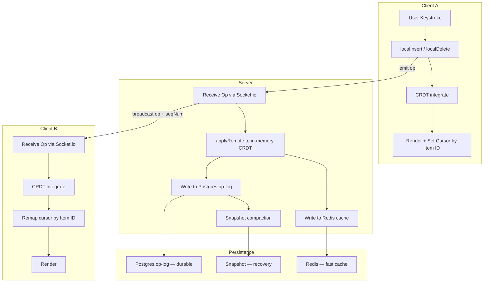

Collaborative CRDT Text Editor
A real-time collaborative text editor built from scratch, similar to Google Docs. Multiple users can edit simultaneously with conflict-free merging and live cursor tracking.
Demo

📹 Two clients editing the same document simultaneously — no conflicts, cursors stay accurate

https://github.com/user-attachments/assets/9b1cc0eb-f4e8-4365-991a-7712ddc1fcc9

How It Works
The Core Problem
When two users type at the same time, you can't just use character indexes — if User A inserts a character at position 3, every index after that shifts. User B's cursor is now wrong.
The Solution: CRDT (Conflict-free Replicated Data Type)
Instead of indexes, every character is a permanent node in a linked list with a unique ID (clientId:clock). The document is a linked list of these nodes.
HEAD ↔ [A, client1:1] ↔ [p, client1:2] ↔ [p, client1:3] ↔ TAIL
When two clients insert at the same position simultaneously, the integrate() function deterministically resolves the conflict using causal ordering — same result on every client, no coordination needed.
Cursor anchoring: Instead of storing cursor as an index, it's stored as an item ID. Remote insertions can shift indexes but never change item IDs — so cursors stay stable.

Persistence Stack
Write path:
  Op received → apply to in-memory CRDT
             → write to Redis (fast cache)
             → write to Postgres op-log (durable)

Read path (on server restart):
  Check Redis → if miss, load latest Postgres snapshot
             → replay missed ops since snapshot
             → rebuild in-memory CRDT
This means the document survives server restarts and late-joining clients get the full history.

Features

Conflict-free concurrent editing via CRDT linked list
Real-time cursor positions for all connected users
Usernames and color-coded cursors
Persistent documents across sessions and server restarts
Late-join support — new clients receive full op history
3-layer persistence: memory → Redis → PostgreSQL

Tech Stack
LayerTechnologyBackendNode.js, FastifyReal-timeSocket.ioCacheRedisDatabasePostgreSQL, Prisma ORMFrontendVanilla JS, ContentEditable

Running Locally
Prerequisites: Node.js, Redis, PostgreSQL
bash# Clone the repo
git clone https://github.com/ArnaavSinghSandhu/converge.git
cd crdt-editor

# Install dependencies
npm install

# Set up environment
cp .env.example .env
# Add your DATABASE_URL to .env

# Run Prisma migrations
npx prisma migrate dev

# Start Redis (if not running)
redis-server

# Start the server
node server.js
Open index.html in two browser windows. Both connect to localhost:3000.

